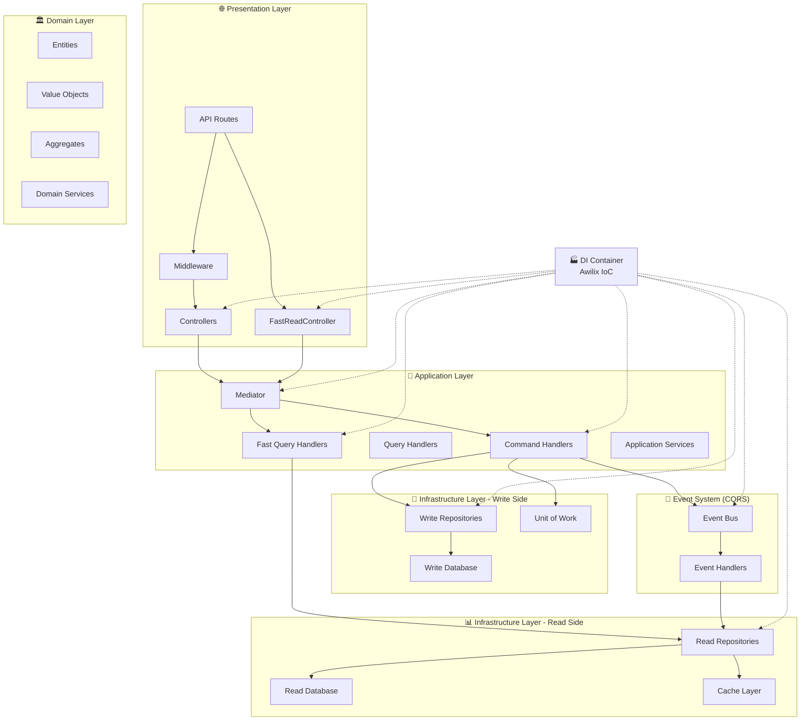
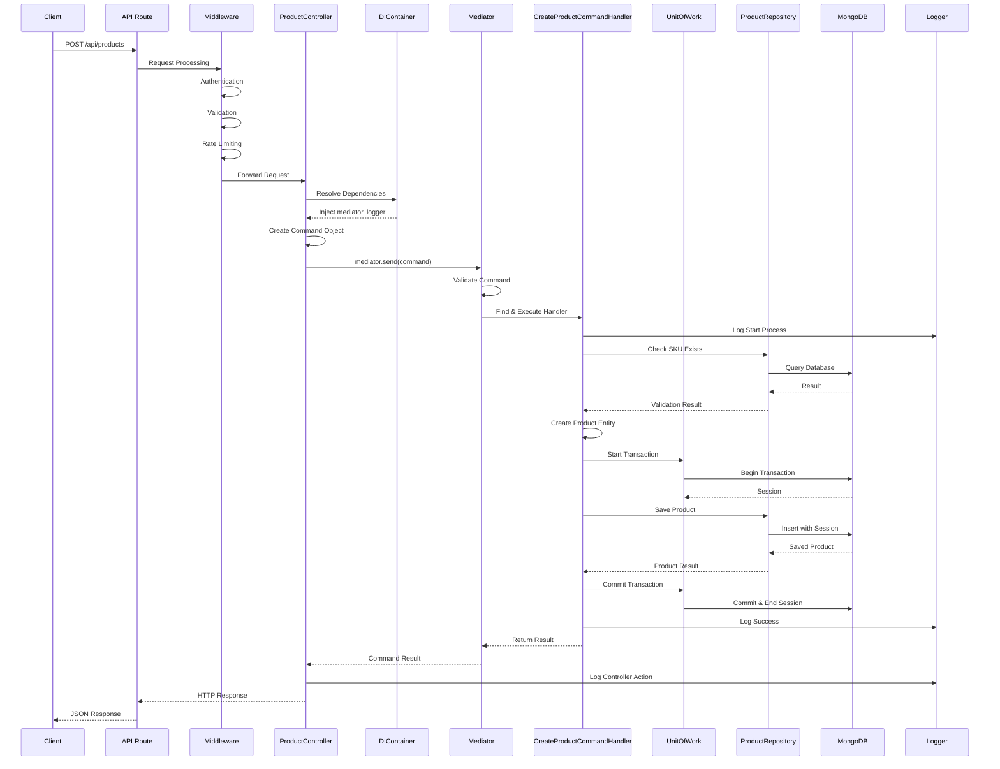
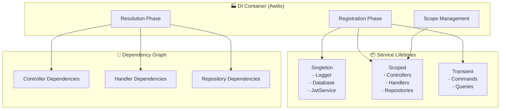
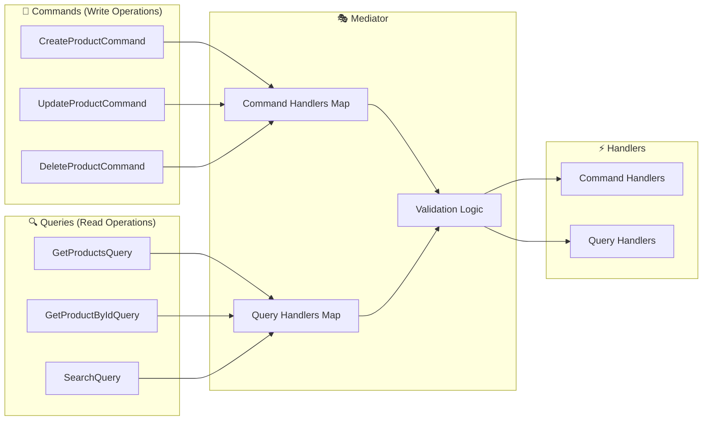
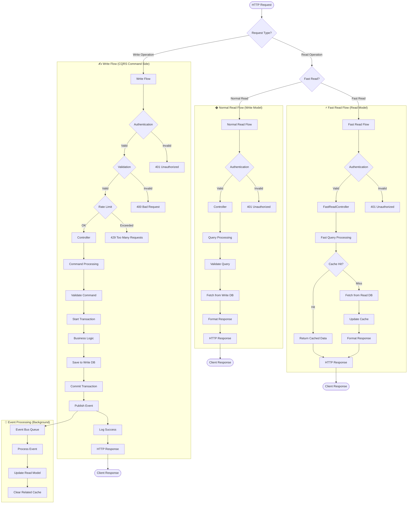
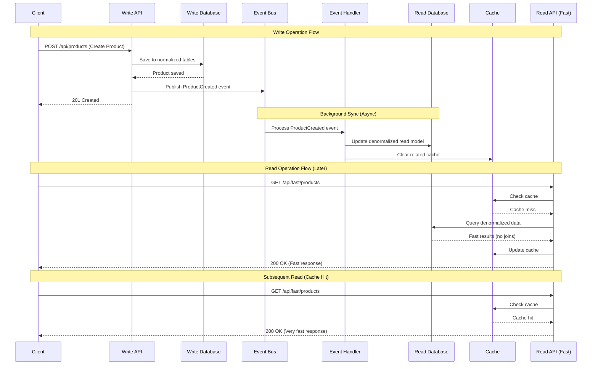

# Sơ Đồ Workflow và Tương Tác Giữa Các Thành Phần

## 🏗️ Tổng Quan Kiến Trúc với CQRS



## 🔄 Chi Tiết Workflow: Tạo Sản Phẩm



## 🏭 DIContainer - Dependency Injection Flow



### DIContainer Functions:
1. **Registration (setupContainer())**:
   - Đăng ký tất cả services với lifetime phù hợp
   - Singleton: Services dùng chung (Logger, Database)
   - Scoped: Services theo request (Controllers, Handlers)
   - Transient: Objects tạo mới mỗi lần (Commands, Queries)

2. **Resolution (resolve())**:
   - Tự động inject dependencies vào constructor
   - Quản lý dependency graph và circular dependencies
   - Lazy loading các dependencies

3. **Mediator Registration**:
   - Đăng ký tất cả Command/Query handlers với Mediator
   - Map command types với handlers tương ứng

## 🎭 Mediator Pattern - CQRS Implementation



### Mediator Functions:
1. **Command Handling**:
   - Nhận command từ controller
   - Validate command data
   - Route đến đúng command handler
   - Write operations (Create, Update, Delete)

2. **Query Handling**:
   - Nhận query từ controller
   - Validate query parameters
   - Route đến đúng query handler
   - Read operations (Get, Search, Filter)

3. **Decoupling**:
   - Controllers không biết về handlers
   - Dễ dàng thêm/sửa handlers
   - Centralized validation và error handling

## 🔄 Unit of Work Pattern

```mermaid
graph TB
    subgraph "🔄 UnitOfWork"
        START[startTransaction()]
        COMMIT[commitTransaction()]
        ROLLBACK[rollbackTransaction()]
        EXEC[executeInTransaction()]
    end

    subgraph "💾 Database Operations"
        SESS[MongoDB Session]
        TRANS[Transaction State]
        OPS[Multiple Operations]
    end

    START --> SESS
    SESS --> TRANS
    TRANS --> OPS
    
    OPS --> COMMIT
    OPS --> ROLLBACK
    
    EXEC --> START
    EXEC --> COMMIT
    EXEC --> ROLLBACK
```

### Unit of Work Functions:
1. **Transaction Management**:
   - Đảm bảo ACID properties
   - All-or-nothing operations
   - Consistency across multiple repositories

2. **Session Handling**:
   - Quản lý MongoDB sessions
   - Auto cleanup resources
   - Error handling và rollback

## 🔄 Complete Request Flow



## 🎯 CQRS Event-Driven Synchronization



## 📊 Architecture Benefits

### ✅ CQRS (Command Query Responsibility Segregation)
- **Separate Read/Write Models**: Tối ưu riêng biệt cho từng loại operation
- **Read Model Denormalization**: Data được flatten để queries nhanh hơn
- **Independent Scaling**: Scale read và write operations độc lập
- **Event-Driven Sync**: Read models được sync qua events từ write models
- **Performance**: Read operations có thể nhanh gấp 2-10x so với write model

### ✅ Clean Architecture
- **Separation of Concerns**: Mỗi layer có trách nhiệm rõ ràng
- **Dependency Inversion**: Depend on abstractions, not concretions
- **Testability**: Dễ dàng unit test từng component

### ✅ SOLID Principles
- **Single Responsibility**: Mỗi class có 1 nhiệm vụ duy nhất
- **Open/Closed**: Mở cho extension, đóng cho modification
- **Liskov Substitution**: Có thể thay thế implementations
- **Interface Segregation**: Interfaces nhỏ và focused
- **Dependency Inversion**: High-level modules không depend vào low-level

### ✅ Design Patterns
- **CQRS**: Tách biệt read/write operations với models riêng
- **Event Sourcing**: Event-driven synchronization
- **Mediator**: Decoupling giữa controllers và handlers
- **Repository**: Abstraction cho data access
- **Unit of Work**: Transaction management
- **Dependency Injection**: Loose coupling và testability

### ✅ Scalability & Maintainability
- **Modular Design**: Dễ dàng thêm features mới
- **Error Handling**: Centralized error management
- **Logging**: Comprehensive monitoring
- **Caching**: Performance optimization với multiple layers
- **Security**: Authentication, authorization, rate limiting
- **Performance**: Read model có thể cache aggressive hơn write model

## 🚀 CQRS Performance Benefits

### Read Model Advantages:
1. **Denormalized Data**: Giảm joins, faster queries
2. **Optimized Indexes**: Indexes được tối ưu cho read patterns
3. **Aggressive Caching**: Cache được longer vì read-only
4. **Separate Database**: Có thể dùng read replicas hoặc different DB
5. **Text Search**: Full-text indexes cho search performance

### API Endpoints Comparison:

**Write Model (Normalized):**
- `GET /api/products` - Standard queries từ write database
- `GET /api/inventory` - Complex joins và calculations

**Read Model (Denormalized):**
- `GET /api/fast/products` - Pre-calculated, cached results
- `GET /api/fast/inventory/analytics/summary` - Pre-aggregated data
- `GET /api/fast/products/search` - Optimized text search
- `GET /api/fast/performance/compare` - Performance comparison

### Performance Metrics Expected:
- **Read Speed**: 2-10x faster than write model
- **Cache Hit Rate**: 80-95% for read model
- **Search Performance**: 5-20x faster với text indexes
- **Analytics Queries**: 10-100x faster với pre-aggregated data
