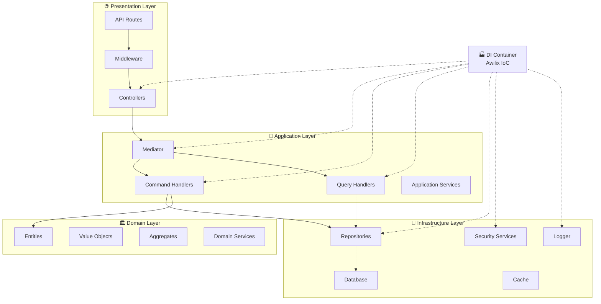
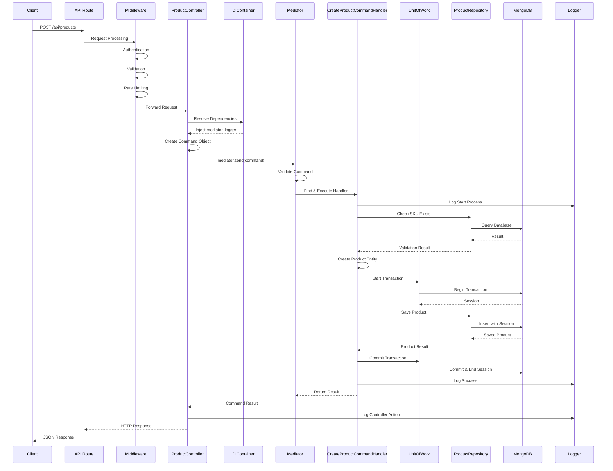
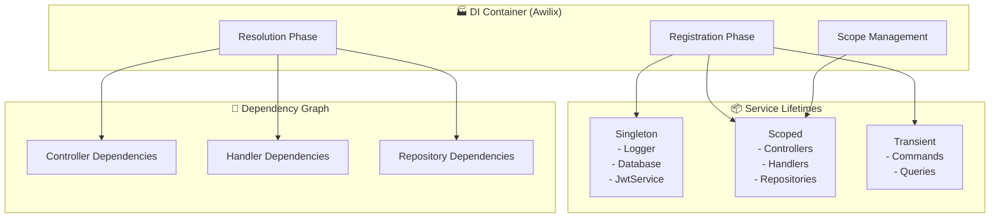
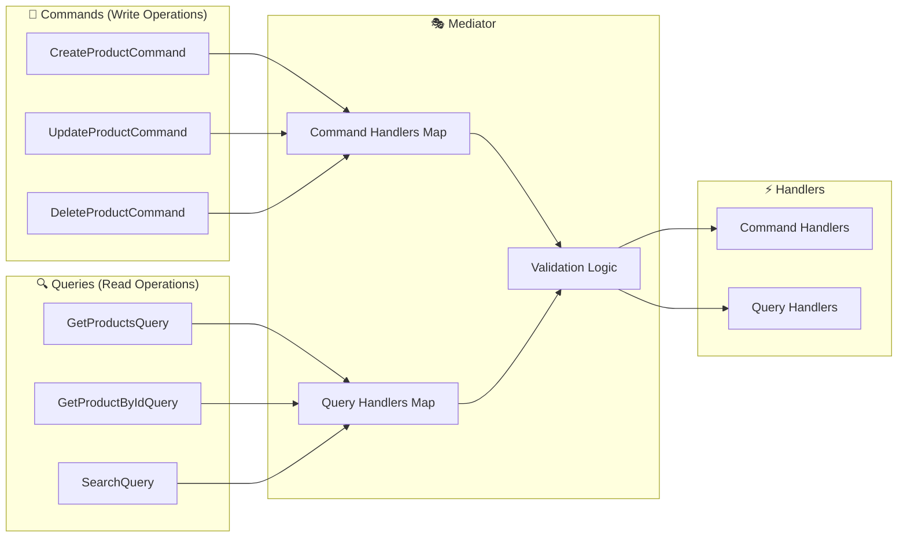
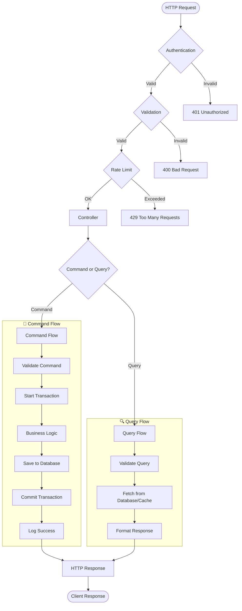

# Sơ Đồ Workflow và Tương Tác Giữa Các Thành Phần

## 🏗️ Tổng Quan Kiến Trúc



## 🔄 Chi Tiết Workflow: Tạo Sản Phẩm



## 🏭 DIContainer - Dependency Injection Flow



### DIContainer Functions:
1. **Registration (setupContainer())**:
   - Đăng ký tất cả services với lifetime phù hợp
   - Singleton: Services dùng chung (Logger, Database)
   - Scoped: Services theo request (Controllers, Handlers)
   - Transient: Objects tạo mới mỗi lần (Commands, Queries)

2. **Resolution (resolve())**:
   - Tự động inject dependencies vào constructor
   - Quản lý dependency graph và circular dependencies
   - Lazy loading các dependencies

3. **Mediator Registration**:
   - Đăng ký tất cả Command/Query handlers với Mediator
   - Map command types với handlers tương ứng

## 🎭 Mediator Pattern - CQRS Implementation



### Mediator Functions:
1. **Command Handling**:
   - Nhận command từ controller
   - Validate command data
   - Route đến đúng command handler
   - Write operations (Create, Update, Delete)

2. **Query Handling**:
   - Nhận query từ controller
   - Validate query parameters
   - Route đến đúng query handler
   - Read operations (Get, Search, Filter)

3. **Decoupling**:
   - Controllers không biết về handlers
   - Dễ dàng thêm/sửa handlers
   - Centralized validation và error handling

## 🔄 Unit of Work Pattern

```mermaid
graph TB
    subgraph "🔄 UnitOfWork"
        START[startTransaction()]
        COMMIT[commitTransaction()]
        ROLLBACK[rollbackTransaction()]
        EXEC[executeInTransaction()]
    end

    subgraph "💾 Database Operations"
        SESS[MongoDB Session]
        TRANS[Transaction State]
        OPS[Multiple Operations]
    end

    START --> SESS
    SESS --> TRANS
    TRANS --> OPS
    
    OPS --> COMMIT
    OPS --> ROLLBACK
    
    EXEC --> START
    EXEC --> COMMIT
    EXEC --> ROLLBACK
```

### Unit of Work Functions:
1. **Transaction Management**:
   - Đảm bảo ACID properties
   - All-or-nothing operations
   - Consistency across multiple repositories

2. **Session Handling**:
   - Quản lý MongoDB sessions
   - Auto cleanup resources
   - Error handling và rollback

## 🎯 Complete Request Flow



## 📊 Architecture Benefits

### ✅ Clean Architecture
- **Separation of Concerns**: Mỗi layer có trách nhiệm rõ ràng
- **Dependency Inversion**: Depend on abstractions, not concretions
- **Testability**: Dễ dàng unit test từng component

### ✅ SOLID Principles
- **Single Responsibility**: Mỗi class có 1 nhiệm vụ duy nhất
- **Open/Closed**: Mở cho extension, đóng cho modification
- **Liskov Substitution**: Có thể thay thế implementations
- **Interface Segregation**: Interfaces nhỏ và focused
- **Dependency Inversion**: High-level modules không depend vào low-level

### ✅ Design Patterns
- **CQRS**: Tách biệt read/write operations
- **Mediator**: Decoupling giữa controllers và handlers
- **Repository**: Abstraction cho data access
- **Unit of Work**: Transaction management
- **Dependency Injection**: Loose coupling và testability

### ✅ Scalability & Maintainability
- **Modular Design**: Dễ dàng thêm features mới
- **Error Handling**: Centralized error management
- **Logging**: Comprehensive monitoring
- **Caching**: Performance optimization
- **Security**: Authentication, authorization, rate limiting
